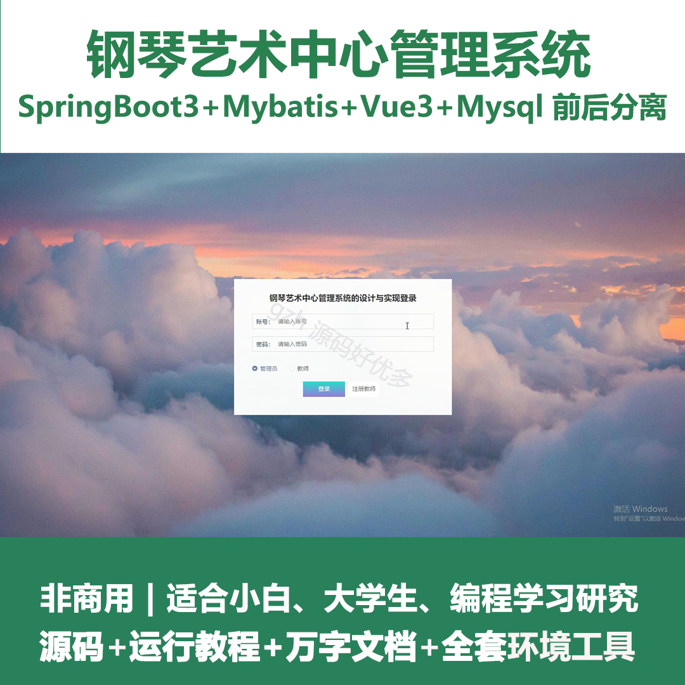
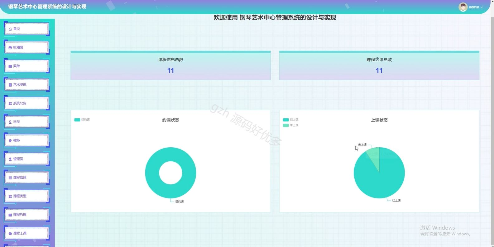
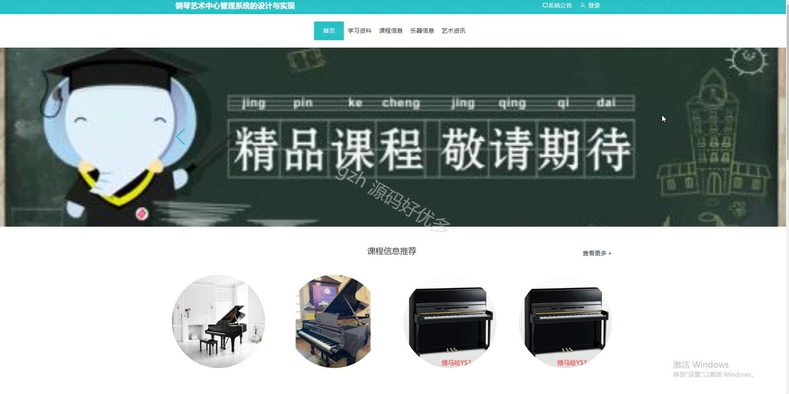
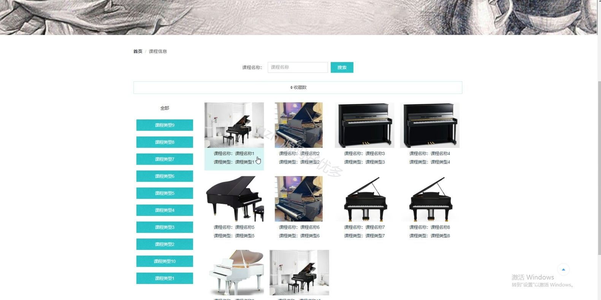
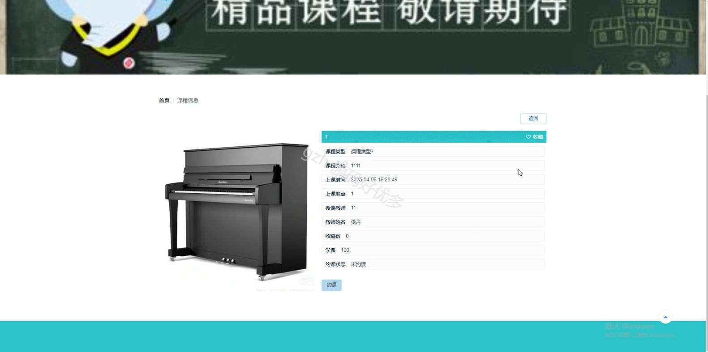
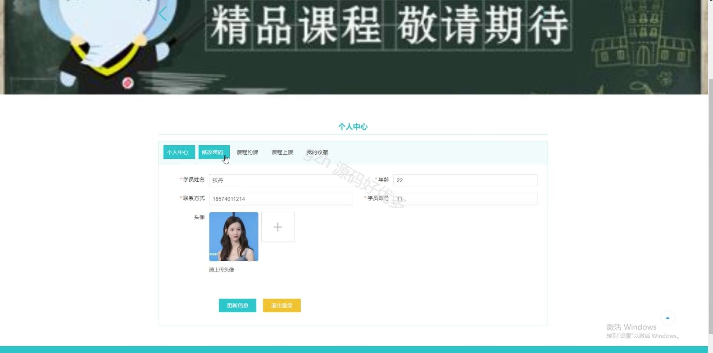
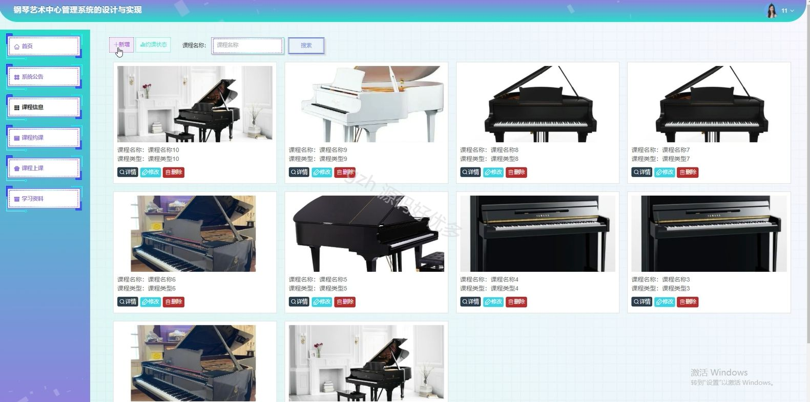
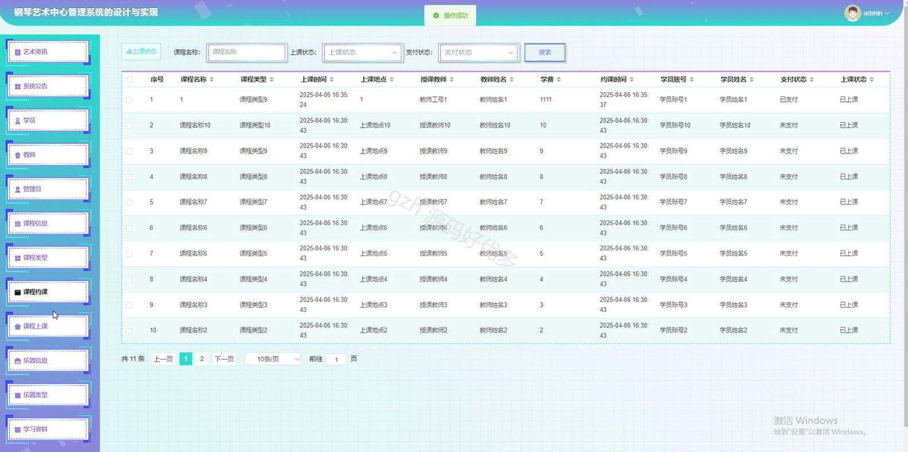
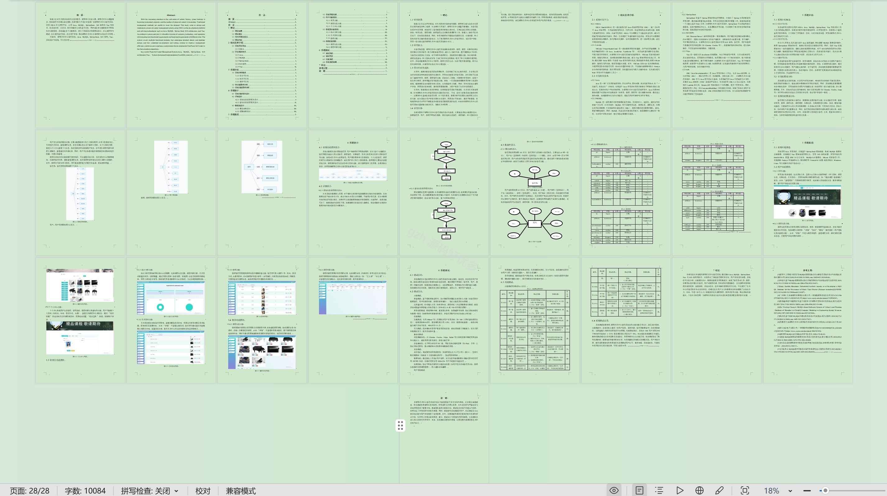

# springbootA392D
springbootA392D钢琴艺术中心管理系统的设计与实现
## 查看主页获取源码

### 一、关键词

乐器信息、钢琴课程、艺术课程

 

### 二、作品包含

源码+数据库+设计文档万字+全套环境和工具资源+部署教程

 

### 三、项目技术

前端技术：Html、Css、Js、Vue3.0、Element-plus
后端技术：Java、SpringBoot3.0、MyBatis

  

 

### 四、运行环境（以下版本亲测，其他版本未知，请自测）

开发工具：IDEA/eclipse  + VSCODE

数据库：MySQL5.7（最低要5.7版本）

数据库管理工具：Navicat10以上版本

环境配置软件： jdk17 + Maven3.6.3

前端Nodejs：20

浏览器：谷歌浏览器

 

### 五、项目介绍

项目编号：springbootA392D

钢琴艺术中心管理系统可实现课程信息管理，提升中心运营效率与教学服务质量。

角色：管理员、用户、教师

管理员功能：首页、轮播图、菜单、艺术资讯、系统公告、学员、教师、管理员、课程信息、课程类型、课程约课、课程上课、乐器信息、乐器类型、学习资料。

用户功能：首页、学习资料、课程信息、乐器信息、艺术资讯、个人中心、修改密码、课程约课、课程上课、我的收藏。

教师功能：首页、系统公告、课程信息、课程约课、课程上课、学习资料。

 

### 六、运行截图

